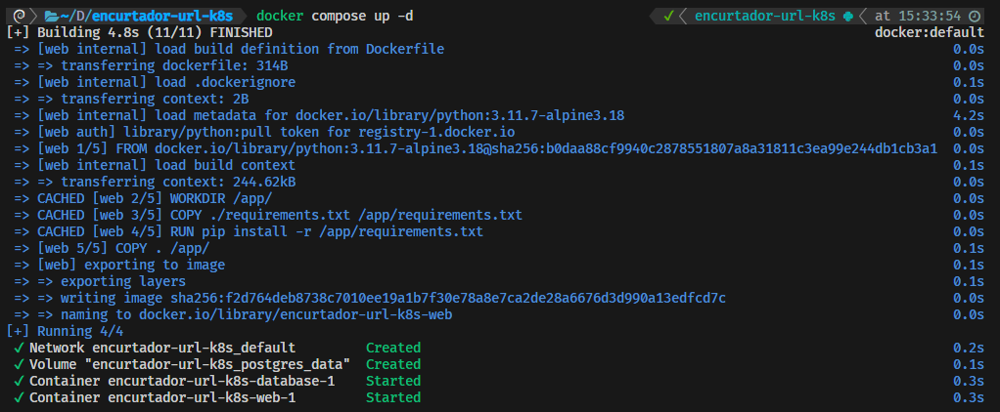
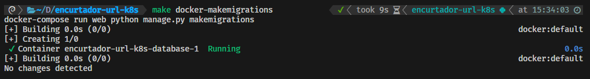
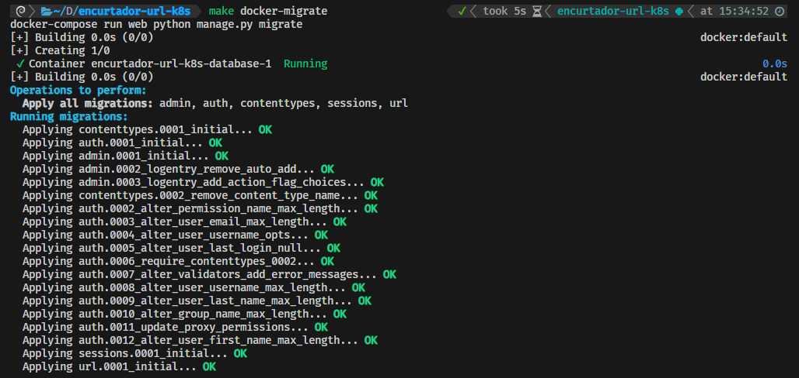
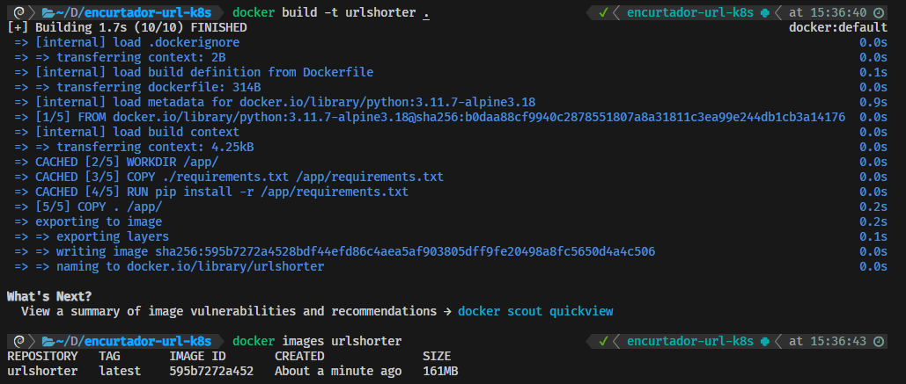
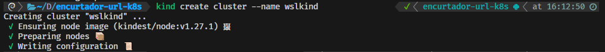
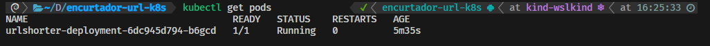
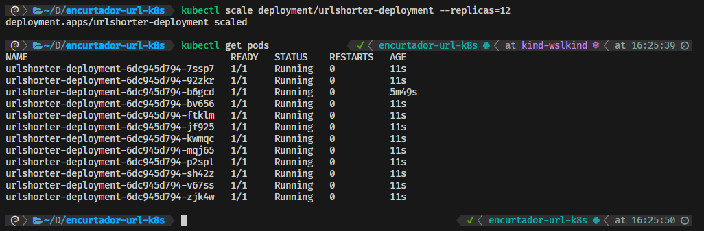

# kubernetes-workshop

Esta é uma aplicação ponta a ponta, ou seja, desde o desenvolvimento até a produção.

**URL shorter**, ou, **Encurtador de URL** é uma aplicação que recebe uma URL e retorna um *hash* da URL original tornando uma URL curta, que ao ser acessada redireciona para a URL original e grava a quantidade de acessos a URL curta e a URL original.

Por exemplo, a URL de um dos meus artigos no Medium é essa: `https://dev.to/leogregianin/python-e-facil-go-e-simples-simples-e-diferente-de-facil-5b9o` e poderia ficar somente `http://encurtador_de_url.com/abc123`.

O objetivo é mostrar como é possível criar uma aplicação utilizando as melhores práticas de desenvolvimento e deploy.

Utiliza as tecnologias **Django** para backend e frontend, **Django Rest Framework** para API, **Postgres** como banco de dados e **Docker** e **Kubernetes** para containerização e orquestração do deploy.

URL shorter é uma aplicação pequena e é utilizada para fins didáticos de como construir uma aplicação e escalar ela utilizando Kubernetes.

Existem diversos *trade-offs* ao utilizar **Kubernetes**, os benefícios e desvantagens podem ser vistos na imagem abaixo e mais detalhes nos próximos artigos escritos no [dev.to](https://dev.to/leogregianin) e [Medium](https://medium.com/@leogregianin).

## Requisitos técnicos

### Rodar a aplicação:
    $ mv .env.example .env
    $ docker compose up -d

### Rodar comandos no container:
    $ make docker-makemigrations
    $ make docker-migrate
    $ make docker-createsuperuser
    $ make docker-collectstatic

### Criar imagem para DockerHub:
    $ docker build -t urlshorter .
    $ docker images urlshorter

    $ docker tag urlshorter:latest leogregianin/urlshorter:0.0.1
    $ docker push leogregianin/urlshorter:0.0.1

### Cria cluster e control panel
    $ kind create cluster --name wslkind

### Deploy com Kubernetes:
    $ kubectl apply -f infra/deployment.yaml
    $ kubectl get deploy

    $ kubectl apply -f infra/service.yaml
    $ kubectl get svc

    $ kubectl get pods

### Escalar a aplicação:
    $ kubectl scale deployment/urlshorter-deployment --replicas=12
    $ kubectl get pods

